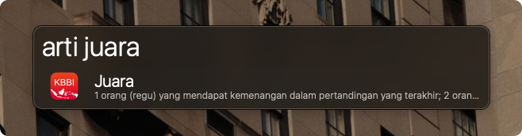
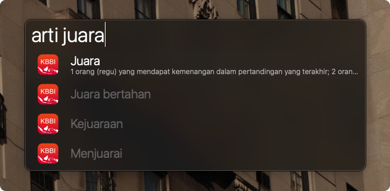

# Arti Kata (KBBI) - OFFLINE :book:

Cari arti kata di KBBI menggunakan keyword. 
Workflow ini menggunakan database sendiri (didalam folder workflow), jadi tidak membutuhkan koneksi internet.

## Screenshot :camera:

Untuk mencari kata lain yang berkaitan, cukup menekan `⌘ + Enter`

## Command List :robot:

| Command            | Deskripsi                   |
|--------------------|-----------------------------|
| arti atau kata     | menggunakan workflow        |
| ⌘ + L              | large type arti kata        |
| ⌘ + C              | copy hasil definisi kata    |

## Version :firefighter:
#### 1.2.0
* Membersihkan duplikat kata
* Menghilangkan proses parsing kata (lebih cepat)

#### 1.0.0
* Released versi offline