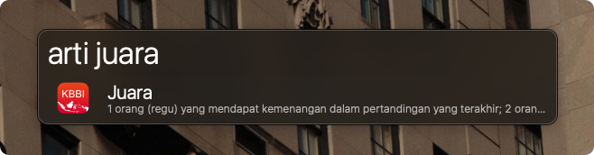
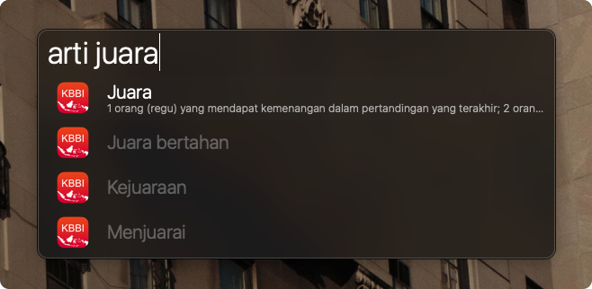

# Arti Kata (KBBI) :book:

Cari arti kata di KBBI menggunakan keyword. Database yang digunakan dari http://kateglo.com

## Screenshot :camera:

Untuk mencari kata lain yang berkaitan, cukup menekan `⌘ + Enter`

## Command List :robot:

| Command            | Deskripsi                   |
|--------------------|-----------------------------|
| arti atau kata     | menggunakan workflow        |
| ⌘ + Enter          | pilihan kata yang berkaitan |
| ⌘ + L              | large type arti kata        |
| ⌘ + C              | copy hasil definisi kata    |

## Version :firefighter:
### 3.0.0
* Perbaharui pengaturan user Alfred 5+
* Clean code script Arti Kata

#### 2.0.0
* Pencarian lebih cepat
* Pencarian sesuai kata (keyword) atau kata yang berhubungan

#### 1.1.0
* Fix sort pencarian (agar sesuai kata pencarian)
* Menambah Universal Action untuk teks

#### 1.0.0
* Released.